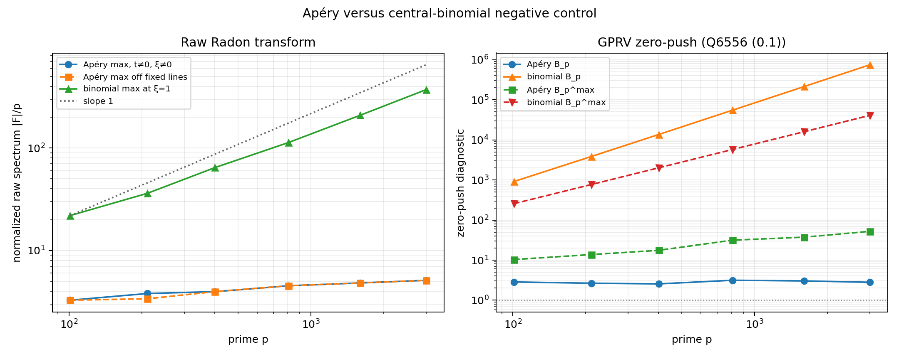

# Refined cyclic Radon-spectrum experiment (Q6556 Sections 7--8)

## Outcome

The experiment separates the Apéry table cleanly from the central-binomial
negative control on the tested range \(p=101,\ldots,3001\).

- The primary Apéry zero-push statistic is flat: \(B_p\) stays between
  \(2.5536\) and \(3.1446\), with fitted log--log slope \(0.0219\).
- The central-binomial zero-push statistic grows quadratically:
  \(B_p=916.80\) at \(p=101\) and \(752513.93\) at \(p=3001\), with fitted
  slope \(1.9799\).
- The central-binomial off-axis control
  \(\max_{t\ne0}F_{\rm bin}(t,1)/p\) grows from \(21.916\) to \(372.101\);
  its finite-range slope is \(0.8414\), approaching the predicted
  \(\eta=1\) behavior.
- The Apéry raw maximum away from \(\xi=0\) only grows from \(3.265\) to
  \(5.106\). Its fitted slope is \(0.1301\), or \(0.1446\) after deleting the
  full fixed affine-line family used in the exceptional-locus test. This is
  mild extreme-value growth, not evidence of a diffuse positive-power ridge
  on this prime range.

Thus the primary GPRV diagnostic \(B_p=O(1)\) passes empirically for Apéry and
fails decisively for the negative control. This is forward-model evidence
only; it is not an inverse theorem producing a bounded-conductor sheaf.



## Frozen protocol

The script uses the full cyclic \((r,h)\)-plane, with \(s=r+h\pmod p\), and
computes

\[
F_p(t,\xi)=\sum_{r,h\in\mathbf F_p}
 e_p\!\left(tD_p(r,r+h)+\xi h\right).
\]

For the Apéry and random-table `circ` data, the diagonal \(s=r\), reflection
\(s=-1-r\), and restart row/column \(r=-1\) or \(s=-1\) are deleted as a
disjoint union before transformation. Q6556 does not specify a further
numerical constant subtraction, so the primary zero-push statistic applies
no additional centering:

\[
B_p=\frac1p\sum_h |C_p^\circ(h)|^2,
\qquad
B_p^{\max}=\frac1{\sqrt p}\max_\xi
 |\widehat C_p^\circ(\xi)|.
\]

The script also records `active_cells(h)/p` model-centered and empirical-mean
centered sensitivity statistics. The binomial control follows Q6556 Section 7
literally: its raw factorized spectrum and its collision count both remain
uncentered, including \(h=0\).

The thresholds \(4,5,6,8,10\), the affine lines
\(\xi=at+b\) with \(a\in[-3,3]\), \(b\in[-2,2]\), and the random seed
`20260801` were fixed before the prime sweep. All coordinates below use the
positive-sign \(e_p(tD+\xi h)\) convention.

## Correctness checks

Before the large sweep, the script ran 24 exact or numerical checks at
\(p=5,7,11\). They cover the binomial recurrence against exact binomial
coefficients, the binomial zero plateau, direct versus factorized
\(F_{\rm bin}\), Apéry endpoint/reflection identities, histogram cell counts,
the two-dimensional FFT against a slow direct transform, the \(t\)-push
identity, and Parseval. The result was

```text
VALIDATION PASS checks=24
max_fft_err=1.217e-14
max_bin_factor_err=1.030e-13
max_push_err=7.105e-15
```

## Apéry raw transform

The median, 99th percentile, and threshold counts use every
\((t,\xi)\) with \(t\ne0\). `max off axis` additionally deletes \(\xi=0\).

| \(p\) | max | max off axis | median | q99 | \(N_{>4}\) | \(N_{>5}\) | \(N_{>6}\) | \(N_{>8}\) | \(N_{>10}\) |
|---:|---:|---:|---:|---:|---:|---:|---:|---:|---:|
| 101  | 6.159 | 3.265 | 0.6611 | 2.5304 | 10  | 4  | 2 | 0 | 0 |
| 211  | 4.791 | 3.796 | 0.6700 | 2.5347 | 10  | 0  | 0 | 0 | 0 |
| 401  | 5.203 | 3.957 | 0.6617 | 2.5624 | 22  | 4  | 0 | 0 | 0 |
| 809  | 6.270 | 4.517 | 0.6702 | 2.5692 | 72  | 12 | 2 | 0 | 0 |
| 1601 | 6.160 | 4.814 | 0.6727 | 2.5788 | 214 | 18 | 4 | 0 | 0 |
| 3001 | 6.581 | 5.106 | 0.6743 | 2.5756 | 672 | 28 | 2 | 0 | 0 |

The bulk is stable: the median remains in \(0.661\)--\(0.674\), and q99 in
\(2.530\)--\(2.579\). Away from \(\xi=0\), only 538 of the 9,000,000 points
at \(p=3001\) exceed 4 (fraction \(5.98\times10^{-5}\)); four exceed 5 and
none exceed 6.

### Exceptional-locus audit

The first maximum always lies on \(\xi=0\). At \(p\ge211\), all 12 recorded
largest values lie in the frozen affine-line family; at \(p=101\), 10 of 12
do. Deleting that family leaves the following maxima.

| \(p\) | largest coordinate \((t,\xi)\) | value | top-12 on fixed family | max off fixed family |
|---:|:---:|---:|---:|---:|
| 101  | (58, 0)   | 6.159 | 10 | 3.265 |
| 211  | (18, 0)   | 4.791 | 12 | 3.373 |
| 401  | (99, 0)   | 5.203 | 12 | 3.957 |
| 809  | (358, 0)  | 6.270 | 12 | 4.517 |
| 1601 | (804, 0)  | 6.160 | 12 | 4.814 |
| 3001 | (2904, 0) | 6.581 | 12 | 5.106 |

This is the Q6556 decomposition case: the largest residual raw values are
concentrated on a fixed exceptional line rather than spread over a positive
proportion of the plane.

## Zero-push diagnostic

`off-axis max` is the same Fourier maximum after deleting the frequency
\(\xi=0\). `model-centered max` subtracts `active_cells(h)/p`; it is included
only as a sensitivity check and is not substituted for the primary statistic.

| \(p\) | Apéry \(B_p\) | Apéry \(B_p^{\max}\) | off-axis max | model-centered max | binomial \(B_p\) | binomial \(B_p^{\max}\) |
|---:|---:|---:|---:|---:|---:|---:|
| 101  | 2.8515 | 10.348 | 4.409 | 4.507 | 916.80 | 256.42 |
| 211  | 2.6540 | 13.769 | 3.415 | 3.483 | 3855.47 | 770.42 |
| 401  | 2.5536 | 17.578 | 5.004 | 4.955 | 13676.36 | 2013.43 |
| 809  | 3.1446 | 31.502 | 5.077 | 5.112 | 55082.71 | 5760.41 |
| 1601 | 3.0281 | 37.388 | 4.514 | 4.489 | 214680.82 | 16025.57 |
| 3001 | 2.8004 | 52.354 | 4.707 | 4.688 | 752513.93 | 41113.33 |

The exact \(L^2\) prediction is the first Apéry column, and it is flat. The
stronger global \(B_p^{\max}=O(1)\) statement does not hold under the literal
cell-only `circ` convention: every maximizing frequency is \(\xi=0\), and
the uncentered mean creates a growing rank-one component there. Once that
fixed frequency is separated, both the off-axis and model-centered maxima
remain in the narrow range \(3.415\)--\(5.112\). The data therefore support
the primary GPRV diagnostic while also identifying an additional fixed
component that a sheaf decomposition would have to remove.

The fitted zero-push slopes make the contrast quantitative:

| series | log--log slope | \(R^2\) |
|:---|---:|---:|
| Apéry \(B_p\) | 0.0219 | 0.1262 |
| central-binomial \(B_p\) | 1.9799 | 0.99998 |

## Central-binomial negative control

For \(a_p(r)=\binom{2r}{r}\bmod p\), the script verifies the zero plateau
\((p+1)/2\le r\le p-1\), evaluates the factorized spectrum, and retains the
raw uncentered collision function prescribed by Q6556.

| \(p\) | global max | max at \(\xi=1\) | median | q99 | \(N_{>4}\) | \(N_{>5}\) | \(N_{>6}\) | \(N_{>8}\) | \(N_{>10}\) |
|---:|---:|---:|---:|---:|---:|---:|---:|---:|---:|
| 101  | 37.390 | 21.916 | 0.3911 | 16.986 | 308   | 298   | 294   | 258   | 214   |
| 211  | 70.484 | 36.151 | 0.3808 | 21.330 | 746   | 686   | 662   | 636   | 630   |
| 401  | 125.781 | 64.404 | 0.3669 | 5.051 | 1882  | 1620  | 1458  | 1278  | 1214  |
| 809  | 238.163 | 113.300 | 0.3607 | 3.264 | 5166  | 4512  | 4124  | 3560  | 3122  |
| 1601 | 460.171 | 209.130 | 0.3557 | 2.812 | 14080 | 11790 | 10596 | 9134  | 8394  |
| 3001 | 833.240 | 372.101 | 0.3531 | 2.630 | 35692 | 28994 | 26022 | 22522 | 20320 |

At \(p=3001\), the low-frequency maxima are \(833.240\) at \(\xi=0\),
\(372.101\) at \(\xi=\pm1\), \(59.709\) at \(\xi=\pm3\), \(25.680\) at
\(\xi=\pm5\), and \(16.663\) at \(\xi=\pm7\), whereas the corresponding
even frequencies are only \(3.50\)--\(4.51\). This is the predicted
Dirichlet ridge. The large off-axis values and the nearly quadratic \(B_p\)
growth give both required negative-control failures.

## Random cyclic and nonwrapping-mask controls

For each prime, a random projective sequence was sampled with
\(\pi(p-1-r)=\pi(r)\), converted to canonical scalar lifts, and used for both
the full cyclic and masked tables. The table gives the off-axis raw
statistics; threshold counts and all sensitivity fields are retained in the
JSON artifact.

| \(p\) | cyclic max | cyclic median | cyclic q99 | cyclic \(B_p\) | masked max | masked median | masked q99 | masked \(B_p\) |
|---:|---:|---:|---:|---:|---:|---:|---:|---:|
| 101  | 7.623 | 0.6322 | 3.564 | 4.594 | 3.814 | 0.4744 | 2.044 | 1.980 |
| 211  | 9.627 | 0.6138 | 3.510 | 3.014 | 4.823 | 0.4734 | 2.048 | 1.299 |
| 401  | 10.177 | 0.6296 | 3.546 | 3.791 | 7.477 | 0.4764 | 2.081 | 1.566 |
| 809  | 10.724 | 0.6339 | 3.584 | 2.863 | 5.500 | 0.4780 | 2.142 | 1.219 |
| 1601 | 12.508 | 0.6337 | 3.608 | 3.103 | 6.657 | 0.4788 | 2.138 | 1.407 |
| 3001 | 13.283 | 0.6352 | 3.595 | 3.134 | 6.765 | 0.4791 | 2.137 | 1.359 |

The mask lowers the raw scale because it retains roughly half the cells; it
does not create a larger raw maximum in this realization. Its zero-push
Fourier statistic nevertheless exposes a mask effect: at \(p=3001\), the
literal off-axis \(B_p^{\max}\) is \(8.977\) for the masked table versus
\(5.296\) cyclically, while subtracting the varying active-cell main term
reduces the masked value to \(3.647\). This supports Q6556's requirement to
keep cyclic and ordered-mask experiments separate.

## Reproduction and artifacts

Run from this directory:

```bash
python3 CRON_radon2.py
```

`CRON_RADON2_RESULTS.json` contains the exact, unrounded output for every
prime, including every threshold count and fraction, the top coordinates,
the fixed-line labels, low binomial frequencies, cell-mode counts, Parseval
errors, and centered sensitivity statistics. `CRON_RADON2_COMPARISON.png` is
generated from that JSON data by the same run.
